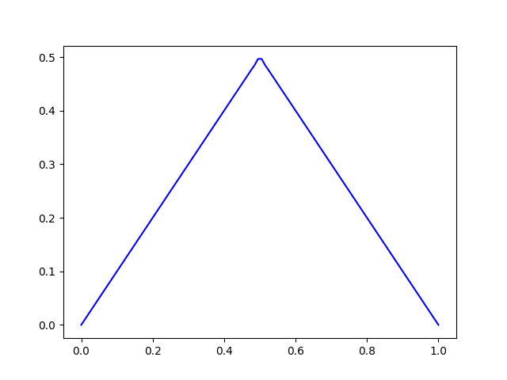

# FEMSolver

FEMSolver is a simple finite element method (FEM) solver written in Python. 
It is designed to solve differential equations in 1D and 2D domains. There is also the support for solving time dependent
problems using finite differences methods.
The project includes example implementations, such as:

- Simulation and animation of the 1D time dependent heat equation
- Simulation and animation of the 2D time dependent wave equation

## Features

- Solve differential equations using the finite element method in 1D and 2D domains.
- Pre-built examples with visualization of the results (including animations).
- Easy to extend and modify for other use cases.

## Requirements

To run this project, you need Python and the following dependencies:

- `numpy`
- `scipy`
- `matplotlib`

Install these dependencies using the following command:

```bash
pip install numpy scipy matplotlib
```

## How to Run

1. Clone the repository:

   ```bash
   git clone https://github.com/SzymonGajda/FEMSolver.git
   cd FEMSolver
   ```

2. Check out the examples available in the `examples/` folder for solving equations and visualizing results.

3. Run the 1D heat equation example:

   ```bash
   python examples/heat_1d.py
   ```

4. Run the 2D wave equation example:

   ```bash
   python examples/wave_2d.py
   ```

5. The results will be saved as animations (if matplotlib backend configured).

## Visualizations

### 1D Heat Equation
An animation demonstrating the solution of the 1D heat equation:



### 2D Wave Equation
An animation demonstrating the solution of the 2D wave equation:


